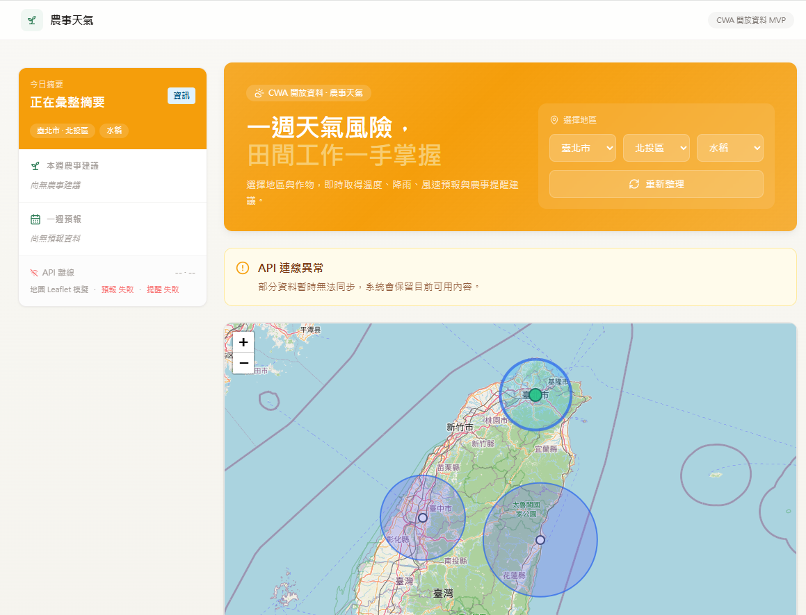

# 農事天氣儀表板

這是一個以台灣 CWA OpenData 為核心的 MVP monorepo，提供一週天氣、農事風險提醒，以及 Leaflet + OpenStreetMap 天氣地圖。

### DEMO截圖:  
### DEMO網址:https://scrape-weather-rfnhzwdm5-gshan1209-cells-projects.vercel.app/
### 開發進度報告: https://github.com/gshan1209-cell/scrape_weather/blob/main/docs/scrape_weather_development_summary.md

## 技術架構

- `apps/api`：FastAPI、Pydantic、httpx、SQLAlchemy-ready models
- `apps/web`：Next.js App Router、TypeScript、Tailwind CSS、shadcn/ui-ready components

## 環境設定

複製 `.env.example` 為 `.env`，如果要讀取即時 CWA 資料，請設定 `CWA_API_KEY`。沒有 API key 時，後端會回傳固定 mock fallback 資料，JSON 格式與正式資料一致。

若本機 Python 連線 CWA 時出現 `CERTIFICATE_VERIFY_FAILED`，開發環境可暫時在 `.env` 設定 `CWA_VERIFY_SSL=false`。正式環境建議維持 `true`，並改用正確的系統憑證或受信任 CA 設定。

天氣地圖 provider：

- `mock`：預設模式，使用 Leaflet + OpenStreetMap 與 mock 天氣 overlay，不需要第三方天氣地圖 API。
- `windy`：預留 Windy Map Forecast client-only skeleton。需設定 `NEXT_PUBLIC_WEATHER_MAP_PROVIDER=windy` 並提供有效的 `NEXT_PUBLIC_WINDY_API_KEY`。

CWA 仍是本專案一週預報與農事提醒的主要資料來源。不要在正式環境使用 Windy trial/testing key，也不要複製 Windy 品牌或完整 UI。

## 看不到地圖怎麼辦

不需要搭配 Google Earth。本專案 MVP 預設使用 Leaflet + OpenStreetMap 顯示台灣地圖，CWA OpenData 提供一週預報與測站資料。

請依序檢查：

1. 確認前端環境變數使用預設 mock provider：

   ```env
   NEXT_PUBLIC_WEATHER_MAP_PROVIDER=mock
   ```

2. 確認 Leaflet CSS 已由 `apps/web/app/globals.css` 載入：

   ```css
   @import "leaflet/dist/leaflet.css";
   ```

3. 確認地圖容器有高度。`LeafletWeatherMap` 預設使用：

   ```tsx
   className="h-[520px] min-h-[70vh] w-full"
   ```

4. 若要啟用 Windy，需設定：

   ```env
   NEXT_PUBLIC_WEATHER_MAP_PROVIDER=windy
   NEXT_PUBLIC_WINDY_API_KEY=your_valid_windy_key
   ```

5. 若 Windy script、Windy key 或初始化 callback 失敗，前端會在約 8 秒內自動切回 Leaflet mock map，並顯示「天氣地圖已切換備援」。

6. 若看不到即時測站，請確認後端有設定 `CWA_API_KEY`。沒有 key 時，一週預報仍會回 mock fallback，但 `/weather/stations` 會回傳空陣列，地圖仍保留區域 mock 點可操作。

### 啟動 API

```powershell
cd apps/api
python -m venv .venv
.\.venv\Scripts\Activate.ps1
pip install -r requirements.txt
uvicorn app.main:app --reload --host 0.0.0.0 --port 8000
```

### 啟動 Web

```powershell
cd apps/web
npm install
npm run dev
```

開啟 `http://localhost:3000`。

## API 端點

- `GET /api/v1/health`
- `GET /api/v1/locations`
- `GET /api/v1/weather/weekly?city=臺北市&district=北投區`
- `GET /api/v1/weather/stations`
- `GET /api/v1/advisory/weekly?city=臺北市&district=北投區&crop=水稻`

FastAPI 文件：`http://localhost:8000/docs`

後端也保留 Windy Point Forecast client skeleton，MVP 預設停用。未來若要啟用，需設定有效的 `WINDY_POINT_FORECAST_API_KEY` 與 `ENABLE_WINDY_POINT_FORECAST=true`。

## 測試

```powershell
cd apps/api
pytest
```

```powershell
cd apps/web
npm run lint
npm run build
```

## 安全注意事項

請把真正的 CWA API key 放在 `.env`，不要提交到 Git。前端只會讀取 `NEXT_PUBLIC_API_BASE_URL`，不會取得 CWA key。

Windy Map Forecast key 屬於前端可見金鑰；正式環境請在 Windy 帳號中設定網域限制與用量限制。MVP 預設地圖使用 OpenStreetMap 圖磚與 mock 天氣 overlay。
